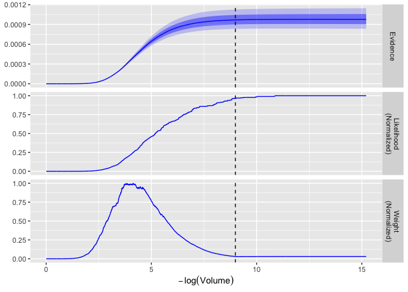

<!-- README.md is generated from README.Rmd. Please edit that file -->

# ernest: Nested Sampling in R

<!-- badges: start -->
<!-- badges: end -->

ernest provides a toolkit for performing the nested sampling algorithm
to estimate the marginal likelihood (i.e., evidence) and posterior
distributions of statistical models. To this end, ernest aims to
accomplish two different goals:

1.  If you’re unfamiliar with nested sampling, ernest and its
    documentation will allow you to learn how nested sampling works and
    how you might incorporate it within your analyses.
2.  If you’re already familiar with nested sampling, ernest provides a
    powerful and reliable implementation of the algorithm and different
    likelihood-restricted prior samplers, allowing you to complete and
    analyse runs with existing tools offered by
    [ggplot](https://CRAN.R-project.org/package=ggplot2) and
    [posterior](https://CRAN.R-project.org/package=posterior).

## Installation

You can install the development version of ernest from
[GitHub](https://github.com/) with:

``` r
# install.packages("devtools")
devtools::install_github("kylesnap/ernest")
```

## Example

To perform nested sampling, R requires two R functions: (1) A
log-likelihood function, describing the likelihood of each point within
the prior space, and a prior transformation function, which can use
points in the (0-1)-unit cube to represent points in the prior space. As
a simple example, we can use a 3D, highly correlated normal
distribution, with a uniform prior in the range of -5 to 5.

``` r
library(ernest)
n_dim <- 3
sigma <- diag(n_dim) # Covariance matrix
sigma[sigma == 0] <- 0.4 
inv_sigma <- solve(sigma) # Precision matrix
det_sigma <- det(sigma) # The determinant of the covariance matrix
l_norm <- -0.5 * (log(2 * pi) * n_dim + log(det_sigma))

# Log-likelihood of the multivariate normal distribution
log_lik <- function(x) {
  -0.5 * drop(crossprod(x, crossprod(inv_sigma, x))) + l_norm
}

# Prior transformation function: (0, 1) -> (-5, 5)
prior_transform <- function(u) {
  5. * (2. * u - 1.)
}
```

With these functions, we call \[nested_sampling()\] to build an
`ernest_sampler` object. This object contains several `S3` methods,
including:

- `generate()`: Perform the nested sampling algorithm until a given
  criteria is met.
- `calculate()`: Prepare a table of iterative model evidence estimates,
  along with point-wise log-likelihoods and posterior importance
  weights.

``` r
sampler <- nested_sampling(
  log_lik,
  prior_transform,
  ptype = n_dim,
  verbose = TRUE
)

run <- generate(sampler, min_logz = 0.01)
run
#> 
#> ── Nested Sampling Run from ernest ─────────────────────────────────────────────
#> No. Live Points: 500
#> No. Iterations: 4499
#> No. Calls: 112475
#> Log Evidence: -6.92927749302562
calculate(run)
#> # A tibble: 4,999 × 6
#>    log_lik  log_vol log_weight log_z log_z_var information
#>      <dbl>    <dbl>      <dbl> <dbl>     <dbl>       <dbl>
#>  1   -53.8 -0.00200      -60.7 -60.7  4.32e-25   -2.16e-22
#>  2   -53.0 -0.00400      -59.5 -59.2  1.77e-24   -8.88e-22
#>  3   -49.3 -0.00599      -56.2 -56.2  3.47e-23   -1.74e-20
#>  4   -49.2 -0.00799      -55.5 -55.1  1.02e-22   -5.10e-20
#>  5   -48.0 -0.00999      -54.6 -54.2  2.58e-22   -1.29e-19
#>  6   -47.4 -0.0120       -53.9 -53.3  5.89e-22   -2.95e-19
#>  7   -46.5 -0.0140       -53.1 -52.5  1.29e-21   -6.46e-19
#>  8   -45.3 -0.0160       -52.0 -51.5  3.37e-21   -1.69e-18
#>  9   -45.1 -0.0180       -51.5 -50.8  6.89e-21   -3.45e-18
#> 10   -43.4 -0.0200       -50.1 -49.7  1.96e-20   -9.83e-18
#> # ℹ 4,989 more rows
```

We can also use the `plot()` method to visualize the iterative
estimations performed during the run, and use the posterior package to
resample from and summarize the posterior distribution.

``` r
plot(run)
```



``` r

posterior::as_draws(run) |>
  posterior::resample_draws() |> 
  posterior::summarize_draws()
#> # A tibble: 3 × 10
#>   variable     mean  median    sd   mad    q5   q95  rhat ess_bulk ess_tail
#>   <chr>       <dbl>   <dbl> <dbl> <dbl> <dbl> <dbl> <dbl>    <dbl>    <dbl>
#> 1 X...1    -0.0391  -0.0573 0.974 0.929 -1.57  1.59  1.12    1083.     14.1
#> 2 X...2     0.0114   0.0148 0.972 0.948 -1.50  1.62  1.18    1058.     15.5
#> 3 X...3     0.00390  0.0253 0.999 0.979 -1.59  1.65  1.24     951.     14.6
```

## Status

`ernest` is still quite experimental, and additional features are
intended to be added in the future. While we hope to avoid them, this
does mean that certain components of ernest may be subject to breaking
changes.

If you encounter any issues or have any suggestions, please feel free to
open an issue.

## Acknowledgements

The nested sampling algorithm was first developed and introduced by J.
Skilling across two major papers:

- Skilling, J. (2004). Nested sampling. In R. Fischer and R. Preuss
  and U. V. Toussaint (Eds.), *Bayesian Inference and Maximum Entropy
  Methods in Science and Engineering* (pp. 395-405). AIP.
  [10.1063/1.1835238](https://doi.org/10.1063/1.1835238)
- Skilling, J. (2006). Nested sampling for general Bayesian computation.
  *Bayesian Analysis*, 1(4), 833-859.
  [10.1214/06-BA127](https://doi.org/10.1214/06-BA127)

ernest’s design takes much inspiration from from the excellent
[dynesty](https://dynesty.readthedocs.io/en/stable/index.html) package,
and from its stellar documentation.

- Speagle, J. S. (2020). DYNESTY: A dynamic nested sampling package for
  estimating Bayesian posteriors and evidences. *Monthly Notices of the
  Royal Astronomical Society*, 493(3), 3132-3158.
  [10.1093/mnras/staa278](https://doi.org/10.1093/mnras/staa278)
- Koposov, S., Speagle, J. S., Barbary, K., Ashton, G., Bennett, E.,
  Buchner, J., Scheffler, C., Cook, B., Talbot, C., Guillochon, J.,
  Cubillos, P., Ramos, A. A., Dartiailh, M., Ilya., Tollerud, E., Lang,
  D., Johnson, B., jtmendel, Higson, E., … Goldstein, D. (2021).
  *dynesty* (Version 1.1.1.) \[Python package\].
  [10.5281/zenodo.4543937](https://doi.org/10.5281/zenodo.4543937)

In addition, the
[nestle](https://github.com/kbarbary/nestle/tree/master) python package
and an article from J. Buchner provided consistent and clear terminology
to describe and organize components of the nested sampling algorithm:

- Buchner, J. (2023). Nested sampling methods. *Statistics Surveys*, 17,
  169-215. [10.1214/23-SS144](https://doi.org/10.1214/23-SS144)
