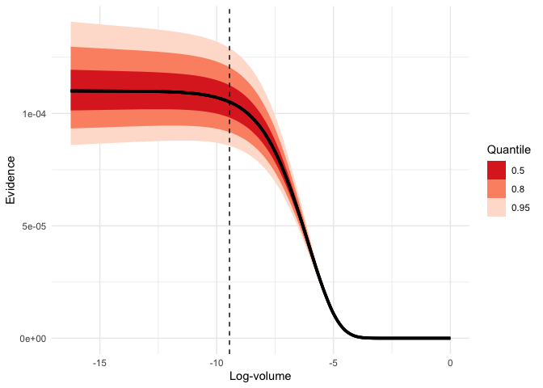
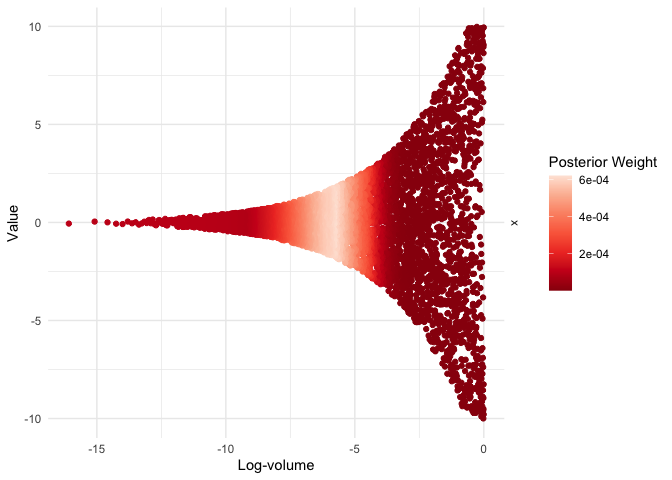

<!-- README.md is generated from README.Rmd. Please edit that file -->

# A Toolkit for Nested Sampling

<!-- badges: start -->

[](https://github.com/ropensci/ernest/actions/workflows/R-CMD-check.yaml)
[](https://app.codecov.io/gh/ropensci/ernest)
[](https://github.com/ropensci/software-review/issues/730)
[](https://CRAN.R-project.org/package=ernest)
<!-- badges: end -->

**ernest** is a comprehensive toolkit for [nested
sampling](https://en.wikipedia.org/wiki/Nested_sampling_algorithm) (NS),
an algorithm for estimating a statistical model’s Bayesian evidence and
posterior distribution. It provides S3 objects and methods that make
nested sampling accessible, flexible, and robust within the R
environment.

## Installation

``` r
# Install `ernest` from CRAN:
install.packages("ernest")

# Install `ernest` from R-Universe
install.packages("ernest", repos = c('https://ropensci.r-universe.dev', 'https://cloud.r-project.org'))

# Install the development version of ernest from Github:
devtools::install_github("ropensci/ernest")
```

To install ernest from source, you’ll need a working C++ compiler. To
get it:

- On Windows, install
  [Rtools](https://cran.r-project.org/bin/windows/Rtools/)
- On Mac, install Xcode from the app store.
- On Linux, `sudo apt-get install r-base-dev` or similar.

## Why use ernest?

Often, statisticians are faced with multiple competing models designed
to describe or estimate a given data set. One way to compare these
models against each other is by evaluating model evidence (also called
[marginal
likelihood](https://en.wikipedia.org/wiki/Marginal_likelihood)), found
by integrating a model’s likelihood function across all possible values
of its parameters. In Bayesian inference, evidence represents the
parameter-independent probability of the data occurring under a given
model—calculating and comparing evidence values across different models,
such as through using [Bayes
factors](https://en.wikipedia.org/wiki/Bayes_factor), plays an important
role in Bayesian inference.

Calculating evidence directly is challenging, as it requires evaluating
a high-dimensional integral over the parameter space. Nested sampling
estimates this integral by dividing the space into a series of small
volumes. It starts by drawing points from the prior and ranking them by
likelihood. The least likely points are discarded and replaced with new
samples from more restricted likelihood regions, gradually compressing
the search space. Each round of discarding shrinks the explored volume
in a predictable way, helping to approximate the integral.

This approach to estimating evidence offers several advantages over
methods like Markov chain Monte Carlo (MCMC):

- **Robustness**: NS handles complex likelihood surfaces that would
  otherwise be difficult to traverse, such as those with multiple modes
  or discontinuities.
- **Posterior inference**: After a run, discarded samples can be
  weighted to approximate the model’s posterior distribution.
- **Natural stopping criterion**: NS can estimate the amount of evidence
  left within the unexplored prior volume, and can stop sampling once
  this amount gets trivially small.
- **Tractable uncertainty estimates**: The shrinkage at each iteration
  follows a uniform order statistic, so uncertainty can be simulated
  using the results from a single run.

ernest’s implementation of NS offers R users several benefits:

- **Native R implementation**: John Skilling’s NS algorithm is
  implemented in R, with no Python or Fortran dependencies. (C++ is used
  to implement the included likelihood samplers to improve run-time
  efficiency).
- **Type- and size-safety**: ernest helps ensure that the user provides
  likelihood functions and prior specifications meet the requirements of
  the NS algorithm.
- **Familiar methods**: Sampler specifications and results are stored in
  S3 objects. Start or continue an NS run with `generate()`, review
  results with `summary()`, and simulate estimation error with
  `calculate()`.
- **Powerful visualizations**: Plot evidence estimates and analyze
  posterior distributions using [ggplot2](https://ggplot2.tidyverse.org)
  and [posterior](https://mc-stan.org/posterior/).

## Example

``` r
library(ernest)

# Define a prior (i.i.d. multivariate uniform)
prior <- create_uniform_prior(names = c("x", "y", "z"), lower = -10, upper = 10)

# Define a log-likelihood function (multivariate normal)
log_lik_mvn <- function(theta) {
  nvariables <- 3
  sigma <- diag(0.95, nrow = 3) # Covariance matrix
  det_sigma <- log(det(sigma))
  prec <- solve(sigma) # Precision matrix (Sigma^-1)
  log_norm <- -0.5 * (log(2 * pi) * nvariables + det_sigma) # Normalization

  drop(-0.5 * crossprod(theta, crossprod(prec, theta)) + log_norm)
}

# Set up and run the sampler
sampler <- ernest_sampler(
  log_lik_mvn,
  prior = prior,
  nlive = 500
)
run <- generate(sampler, show_progress = FALSE)

# Summarize and visualize results
summary(run)
#> Summary of nested sampling run:
#> ── Run Information ─────────────────────────────────────────────────────────────
#> * No. points: 500
#> * Iterations: 4737
#> * Likelihood evals.: 103830
#> * Log-evidence: -9.1368 (± 0.115)
#> * Information: 4.822
#> ── Posterior Summary ───────────────────────────────────────────────────────────
#> # A tibble: 3 × 6
#>   variable   mean    sd    median   q15   q85
#>   <chr>     <dbl> <dbl>     <dbl> <dbl> <dbl>
#> 1 x        0.0233  2.76 -0.000841 -1.96  2.02
#> 2 y        0.0254  2.78 -0.000344 -1.90  1.96
#> 3 z        0.0110  2.79 -0.00460  -1.89  1.92
#> ── Maximum Likelihood Estimate (MLE) ───────────────────────────────────────────
#> * Log-likelihood: -2.6829
#> * Original parameters: 0.0149, 0.0188, and -0.0715
plot(run, which = "evidence")
```



``` r
visualize(run, x, .which = "trace")
```



For advanced usage, including custom priors and hierarchical models, see
the package vignettes.

## Prior Work

NS has been implemented in many languages. This non-exhaustive list of
popular NS implementations is adapted from [Fowlie
(2021)](https://arxiv.org/abs/2010.13884):

- In Python: [nestle](https://github.com/kbarbary/nestle/tree/master)
  and [dynesty](https://github.com/joshspeagle/dynesty)

- In C++: [DIAMONDS](https://github.com/EnricoCorsaro/DIAMONDS/) and
  [DNest4](https://github.com/eggplantbren/DNest4)\*

- In Fortran:
  [MultiNest](https://github.com/JohannesBuchner/MultiNest)\* and
  [PolyChord](https://github.com/PolyChord/PolyChordLite)

(\* Indicates software that includes an R interface.)

ernest’s design, API, and NS implementation are based on the nestle
package, with further inspiration from dynesty.

The [nestcheck](https://github.com/ejhigson/nestcheck/tree/master)
Python package provides routines for error estimation and diagnostic
plotting with nested sampling runs. Several of ernest’s methods are
based on this work.

## Citing ernest

When using ernest, please at least include the following citations:

- Dewsnap K. (2025). “ernest: A Toolkit for Nested Sampling.” R package
  version XXX, \<URL: (<https://docs.ropensci.org/ernest/>)\>

- Skilling, J. (2006). Nested Sampling for General Bayesian Computation.
  *Bayesian Analysis*, 1(4), 833–859. \<DOI:
  <https://doi.org/10.1214/06-BA127>\>

- Buchner, J. (2023). Nested Sampling Methods. *Statistics Surveys*, 17,
  169–215. \<DOI: <https://doi.org/10.1214/23-SS144>\>

Additional citations for ernest can be found in the package’s vignettes
and within function documentation.
