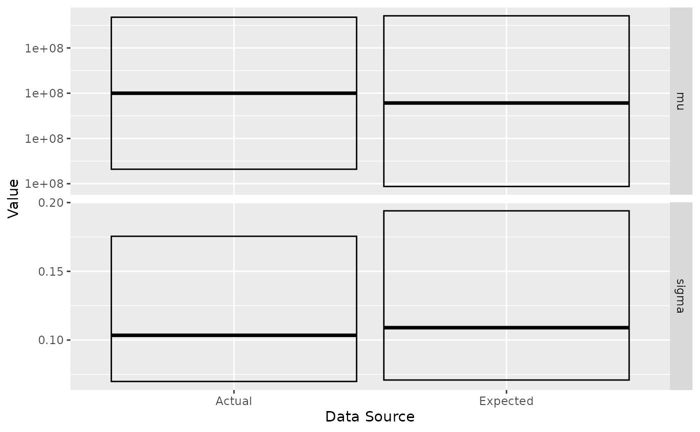

# More Examples with ernest

``` r
library(ernest)
library(posterior)
```

This vignette describes the test problems used by ernest to validate its
sampling behaviour. By reading this, you will learn how different models
can be expressed within ernest and how to examine the `ernest_run`
produced by a sampling run.

## Multimodal Bivariate Gaussian “Blobs”

*From the Python package
[nestle](https://github.com/kbarbary/nestle/blob/master/).*

The goal is to estimate the evidence of a multimodal distribution, made
up of a mixture of two well-separated bivariate Gaussian distributions.
As nested sampling is designed to handle multimodal distributions, this
provides a good test of ernest’s ability to explore a complicated
likelihood surface.

``` r
# Log-likelihood for two Gaussian blobs
sigma <- 0.1
mu1 <- c(1, 1)
mu2 <- -c(1, 1)
sigma_inv <- diag(2) / 0.1**2

gaussian_blobs_loglik <- function(x) {
  dx1 <- -0.5 * mahalanobis(x, c(1, 1), sigma_inv, inverted = TRUE)
  dx2 <- -0.5 * mahalanobis(x, c(-1, -1), sigma_inv, inverted = TRUE)
  matrixStats::colLogSumExps(rbind(dx1, dx2))
}

# Uniform prior over [-5, 5] in each dimension
prior <- create_uniform_prior(lower = -5, upper = 5, names = c("A", "B"))

# Run the model
blob_sampler <- ernest_sampler(
  create_likelihood(vectorized_fn = gaussian_blobs_loglik),
  prior,
  nlive = 100,
  seed = 42L
)
blob_result <- generate(blob_sampler, show_progress = FALSE)
```

The expected log-evidence, found analytically, is $- 6.679$. We may use
the summary and calculate methods to examine how accurate our results
from sampling are:

``` r
summary(blob_result)
#> Summary of nested sampling run:
#> ── Run Information ─────────────────────────────────────────────────────────────
#> * No. points: 100
#> * Iterations: 959
#> * Likelihood evals.: 21252
#> * Log-evidence: -6.5450 (± 0.2613)
#> * Information: 5.527
#> * RNG seed: 42
#> ── Posterior Summary ───────────────────────────────────────────────────────────
#> # A tibble: 2 × 6
#>   variable   mean    sd median   q15   q85
#>   <chr>     <dbl> <dbl>  <dbl> <dbl> <dbl>
#> 1 A        0.106   1.47  0.602 -1.11  1.12
#> 2 B        0.0479  1.49  0.615 -1.14  1.09
#> ── Maximum Likelihood Estimate (MLE) ───────────────────────────────────────────
#> * Log-likelihood: -0.0004
#> * Original parameters: 1.0026 and 0.9990
calculate(blob_result, ndraws = 500)
#> Nested sampling uncertainty estimates:
#> # of Simulated Draws: 500
#> Log-volume: -15 ± 1.4
#> Log-evidence: -6.6 ± 0.24
```

## Eggbox Distribution

*From the Python package
[nestle](https://github.com/kbarbary/nestle/blob/master/).*

The eggbox likelihood is another useful test case that demonstrates
ernest’s ability to properly integrate across multimodal likelihood
surfaces.

``` r
# Log-likelihood for the eggbox function
eggbox_loglik <- function(x) {
  tmax <- 5.0 * pi
  if (!is.matrix(x)) dim(x) <- c(1, length(x))
  t <- sweep(2.0 * tmax * x, 2, tmax, "-")
  (2.0 + cos(t[, 1] / 2.0) * cos(t[, 2] / 2.0))^5.0
}

# Uniform prior over [0, 1] in each dimension
eggbox_prior <- create_uniform_prior(names = c("A", "B"))
```


Analytic results indicate that we should expect a log-evidence of
$235.895$.

``` r
egg_sampler <- ernest_sampler(
  eggbox_loglik,
  eggbox_prior,
  sampler = multi_ellipsoid(),
  seed = 42L
)
egg_result <- generate(egg_sampler, show_progress = FALSE)
#> Warning in rgl.init(initValue, onlyNULL): RGL: unable to open X11 display
#> Warning: 'rgl.init' failed, will use the null device.
#> See '?rgl.useNULL' for ways to avoid this warning.
summary(egg_result)
#> Summary of nested sampling run:
#> ── Run Information ─────────────────────────────────────────────────────────────
#> * No. points: 500
#> * Iterations: 5038
#> * Likelihood evals.: 11493
#> * Log-evidence: 235.9478 (± 0.1198)
#> * Information: 6.038
#> * RNG seed: 42
#> ── Posterior Summary ───────────────────────────────────────────────────────────
#> # A tibble: 2 × 6
#>   variable  mean    sd median   q15   q85
#>   <chr>    <dbl> <dbl>  <dbl> <dbl> <dbl>
#> 1 A        0.512 0.296  0.501 0.103 0.899
#> 2 B        0.502 0.297  0.500 0.102 0.899
#> ── Maximum Likelihood Estimate (MLE) ───────────────────────────────────────────
#> * Log-likelihood: 242.9999
#> * Original parameters: 0.9000 and 0.1000
```

We can further visualise the multimodal structure of each variable:

``` r
visualize(egg_result, .which = "trace")
```


## Incorporating Data within Likelihood Functions

Nested sampling runs are capable of generating estimates of the
posterior distribution. To examine this, we provide a test problem from
the National Institute of Standards and Technology
([NIST](https://www.itl.nist.gov/div898/strd/mcmc/mcmc01.html)).

``` r
y <- c(0.2, 0.1, 0.3, 0.1, 0.3, 0.1, 0.3, 0.1, 0.3, 0.1) + 1e+08
```

The certified posterior quantiles for the mean and standard deviation of
`y` are:

| Parameter | 2.5%                   | 50.0%                  | 97.5%                  |
|-----------|------------------------|------------------------|------------------------|
| mu        | 100000000\.13281908588 | 100000000\.20000000000 | 100000000\.26718091412 |
| sigma     | 0.069871704416342      | 0.103462818336964      | 0.175493354741336      |

To run this model, we must incorporate the data `y` into the likelihood
function. We do this through a function factory that captures a vector
of observations from its environment. The produced function then
computes the log-likelihood of a Gaussian model with parameters mean
`mu` and standard deviation `sigma`.

``` r
gaussian_log_lik <- function(data) {
  force(data)

  function(theta) {
    if (theta[2] <= 0) return(-Inf)
    sum(stats::dnorm(data, mean = theta[1], sd = theta[2], log = TRUE))
  }
}

log_lik <- gaussian_log_lik(y)
prior <- create_uniform_prior(
  names = c("mu", "sigma"),
  lower = c(1e+08 - 1, 0.01),
  upper = c(1e+08 + 1, 1)
)
nist_sampler <- ernest_sampler(log_lik, prior, seed = 42L)
nist_result <- generate(nist_sampler, show_progress = FALSE)
```

We rely on the posterior R package to examine the posterior distribution
by summarising each variable by its quantiles. To better visualise the
correspondence between the expected and actual values, we can plot their
respective IQRs.

``` r
post <- as_draws(nist_result) |>
  resample_draws() |>
  summarise_draws(\(x) quantile(x, probs = c(0.025, 0.5, 0.975)))
post
#> # A tibble: 2 × 4
#>   variable  `2.5%`         `50%`       `97.5%`
#>   <chr>      <dbl>         <dbl>         <dbl>
#> 1 mu       1.00e+8 100000000.    100000000.   
#> 2 sigma    7.09e-2         0.109         0.194
```

    #> # A tibble: 4 × 5
    #>   variable  `2.5%`         `50%`       `97.5%` src  
    #>   <chr>      <dbl>         <dbl>         <dbl> <chr>
    #> 1 mu       1.00e+8 100000000.    100000000.    est  
    #> 2 sigma    7.09e-2         0.109         0.194 est  
    #> 3 mu       1.00e+8 100000000.    100000000.    act  
    #> 4 sigma    6.99e-2         0.103         0.175 act


