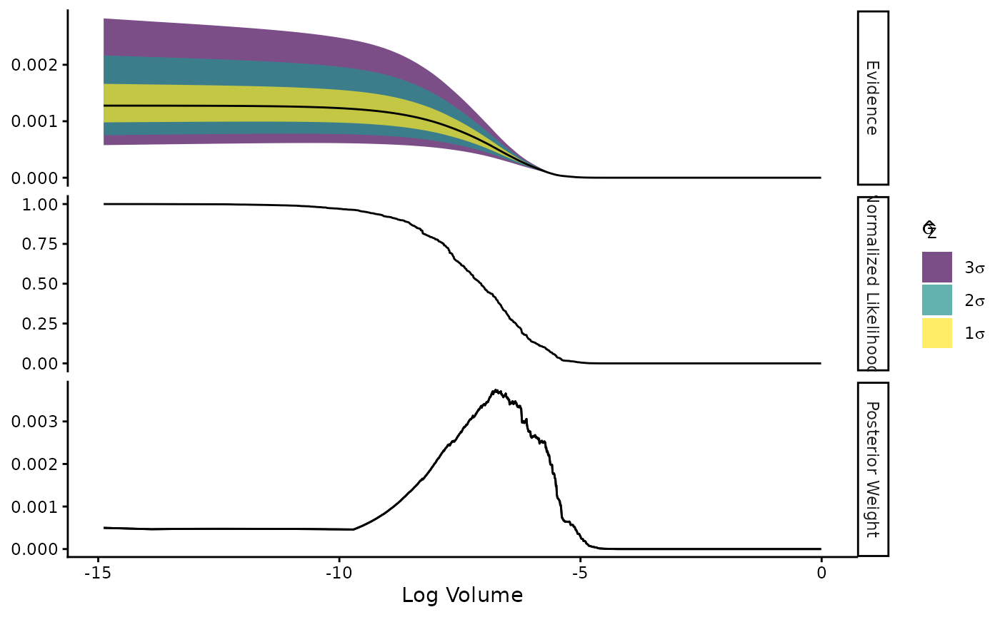
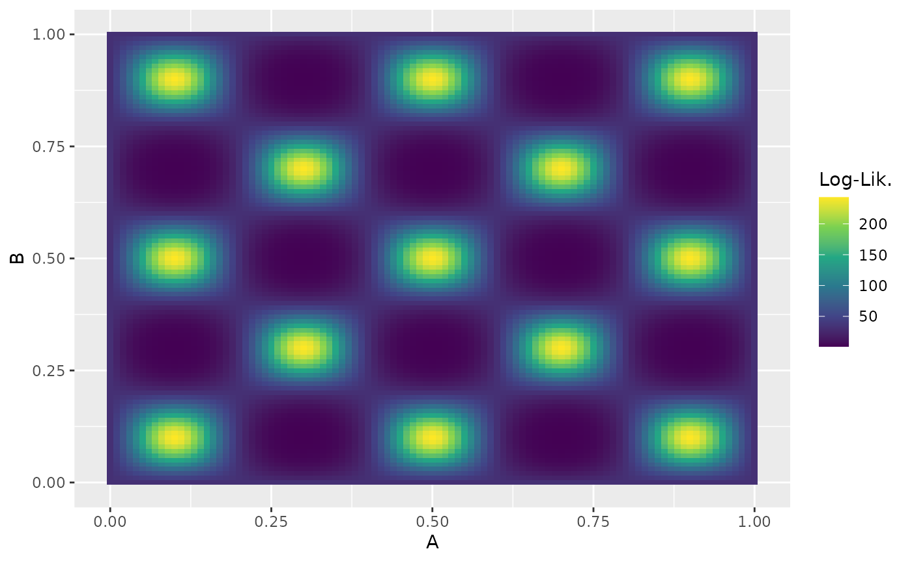

# More Nested Sampling Runs with Ernest

``` r
library(ernest)
set.seed(42)
```

ernest uses comprehensive tests to verify its sampling behaviour against
the Python package
[nestle](https://github.com/kbarbary/nestle/blob/master/). This vignette
describes some of these tests and demonstrates how to construct
likelihood functions for ernest.

## Two Gaussian “Blobs”

We estimate the Bayesian evidence for a simple two-dimensional problem
with two well-separated Gaussian modes—a classical nested sampling test
problem, as the evidence can be solved analytically.

Define the log-likelihood and prior:

``` r
# Log-likelihood for two Gaussian blobs
gaussian_blobs_loglik <- function(x) {
  sigma <- 0.1
  mu1 <- c(1, 1)
  mu2 <- -c(1, 1)
  sigma_inv <- diag(2) / sigma^2

  if (!is.matrix(x)) dim(x) <- c(1, length(x))
  dx1 <- sweep(x, 2, mu1)
  dx2 <- sweep(x, 2, mu2)
  val1 <- -0.5 * rowSums((dx1 %*% sigma_inv) * dx1)
  val2 <- -0.5 * rowSums((dx2 %*% sigma_inv) * dx2)
  matrixStats::rowLogSumExps(cbind(val1, val2))
}

# Uniform prior over [-5, 5] in each dimension
prior <- create_uniform_prior(lower = -5, upper = 5, names = c("A", "B"))
```

Set up the sampler and run nested sampling:

``` r
sampler <- ernest_sampler(gaussian_blobs_loglik, prior, n_points = 100)
result <- generate(sampler, show_progress = FALSE)
#> ℹ Created 100 live points.
#> ✔ `min_logz` reached (0.0498316 < 0.05).
```

For this distribution, the analytical evidence is
$\mathcal{Z} = \log\left( 2^{2}*\pi*0.1^{2}/100 \right) \approx - 6.679$.
Use `summary` to extract the log-evidence (`log_evidence`) and its
uncertainty (`log_evidence_err`):

``` r
smry <- summary(result)
smry
#> nested sampling result summary <summary.ernest_run>
#> • No. Points: 100
#> • No. Iterations: 1007
#> ────────────────────────────────────────────────────────────────────────────────
#> • No. Calls: 22258
#> • Log. Volume: -15.26
#> • Log. Evidence: -7.030 (± 0.2709)
```

Plot the progress of the evidence estimate:

``` r
plot(result)
```



## Example: Estimating the Evidence for the Eggbox Problem

The “eggbox” problem is a challenging test case for nested sampling due
to its highly multimodal likelihood surface. Define the log-likelihood
and prior:

``` r
eggbox_loglik <- function(x) {
  tmax <- 5.0 * pi
  if (!is.matrix(x)) dim(x) <- c(1, length(x))
  t <- sweep(2.0 * tmax * x, 2, tmax, "-")
  (2.0 + cos(t[, 1] / 2.0) * cos(t[, 2] / 2.0))^5.0
}

# Uniform prior over [0, 1] in each dimension
eggbox_prior <- create_uniform_prior(names = c("A", "B"))
```

Visualize the likelihood surface:



Run the sampler and compare the estimated log-evidence to the nestle
result ($\approx 235.895$):

``` r
sampler <- ernest_sampler(eggbox_loglik, eggbox_prior)
result <- generate(sampler, show_progress = FALSE)
#> ℹ Created 500 live points.
#> ✔ `min_logz` reached (0.0499172 < 0.05).
smry <- summary(result)
smry
#> nested sampling result summary <summary.ernest_run>
#> • No. Points: 500
#> • No. Iterations: 5103
#> ────────────────────────────────────────────────────────────────────────────────
#> • No. Calls: 113177
#> • Log. Volume: -17.00
#> • Log. Evidence: 235.8 (± 0.1212)
```

Plot the posterior distribution:

``` r
visualize(result, type = "density")
```


## Adding Data

Often, the likelihood depends on observed data. In ernest, you must
incorporate the data within your likelihood function. Here, we show how
to supply data using both
[`create_likelihood()`](https://kylesnap.github.io/ernest/reference/create_likelihood.md)
and an anonymous function, with a certified dataset from the U.S.
National Institute of Science and Technology
([NIST](https://www.itl.nist.gov/div898/strd/mcmc/mcmc01.html)).

``` r
# Sample data: vector of observations
y <- c(
  100000000.2, 100000000.1, 100000000.3, 100000000.1, 100000000.3,
  100000000.1, 100000000.3, 100000000.1, 100000000.3, 100000000.1, 100000000.3
)

# Model likelihood: Y ~ N(mu, sd)
log_lik <- function(theta, data) {
  if (theta[2] <= 0) {
    return(-Inf)
  }
  sum(stats::dnorm(y, mean = theta[1], sd = theta[2], log = TRUE))
}
```

Note: `log_lik` returns `-Inf` for non-positive standard deviations,
explicitly censoring impossible parameter values.

Supply data using either an anonymous function or the dots argument of
`create_likelihood`:

``` r
# Anonymous function
anon_log_lik <- \(theta) log_lik(theta, data = y)

# Using dots for create_likelihood
expected_mean <- 100000000.200000000000000
expected_sd <- 0.108372230793914
anon_log_lik(c(expected_mean, expected_sd))
#> [1] 10.0784
```

Define the prior for the mean and standard deviation, then run the
sampler. The prior is constrained near the expected posterior values:
the number of iterations required is proportional to the product of the
number of live points (`n_points`) and the [KL
divergence](https://en.wikipedia.org/wiki/Kullback%E2%80%93Leibler_divergence)
between prior and posterior.

``` r
prior <- create_uniform_prior(
  lower = c(99999999, 0.01),
  upper = c(100000001, 1),
  names = c("mu", "sigma")
)
sampler <- ernest_sampler(anon_log_lik, prior)
result <- generate(sampler, show_progress = FALSE)
#> ℹ Created 500 live points.
#> ✔ `min_logz` reached (0.0499724 < 0.05).
```

Examine the estimated posterior distribution:

``` r
draws <- as_draws(result) |>
  posterior::resample_draws()
```

Summarize the posterior for each parameter (e.g., median and 95%
interval):

``` r
posterior::summarise_draws(
  draws,
  \(x) quantile(x, probs = c(0.05, 0.5, 0.95))
)
#> # A tibble: 2 × 4
#>   variable    `5%`         `50%`         `95%`
#>   <chr>      <dbl>         <dbl>         <dbl>
#> 1 mu       1.00e+8 100000000.    100000000.   
#> 2 sigma    7.71e-2         0.109         0.169
```
