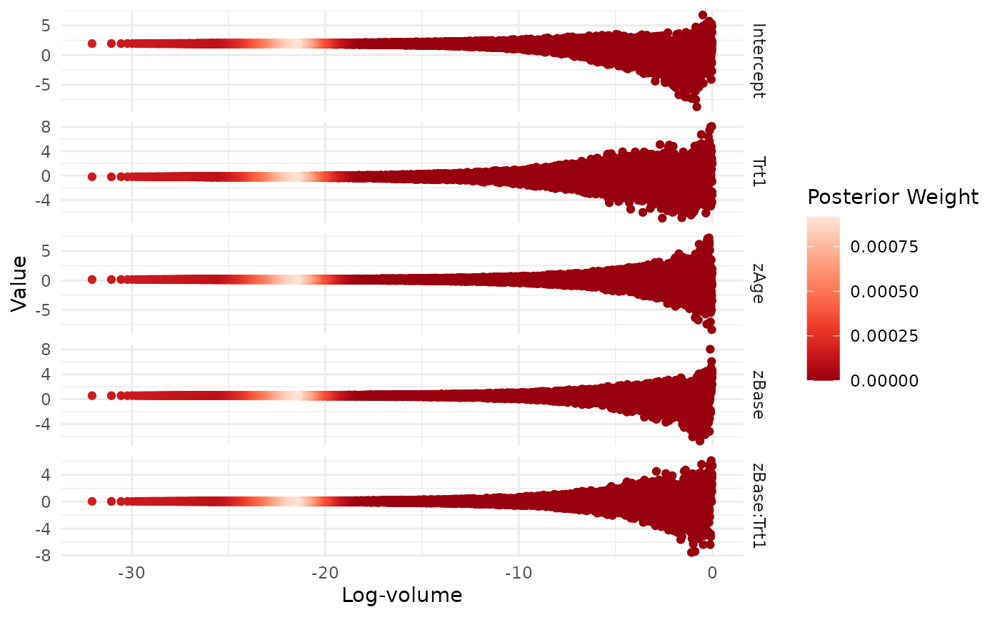
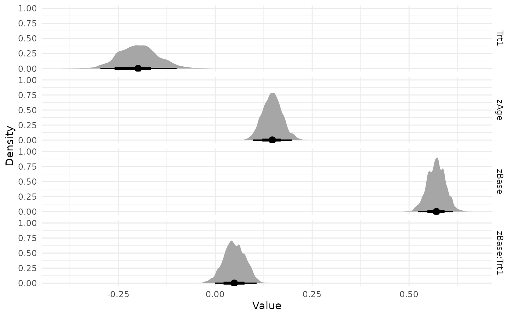

# Nested Sampling with ernest

This vignette introduces the nested sampling algorithm and demonstrates
how to use the ernest R package to estimate model evidence for a
Bayesian model. After reading this, you will know more about the
foundations of nested sampling, and you will be able to use ernest to
perform a basic nested sampling run over a regression model and review
the results.

We focus on providing a basic overview of the theory behind nested
sampling: For more information, consider the more in-depth explorations
offered in Buchner (2023) and Ashton et al. (2022).

## Bayes’ Theorem and Model Evidence

Bayesian inference uses probability to quantify how our knowledge of a
statistical model changes as new data become available. Consider a model
$M$ with $d$ unknown parameters, $\theta$. The prior distribution,
$\Pr\left( \theta|M \right) = \pi(\theta)$, encodes beliefs about
$\theta$ before seeing the data. Bayes’ theorem describes how to update
the prior after observing data $D$(Skilling 2006):

$$\begin{aligned}
{\Pr\left( D|M,\theta \right) \times Pr\left( \theta|M \right)} & {= \Pr\left( \theta|M,D \right) \times \Pr\left( D|M \right)} \\
{\text{Likelihood} \times \text{Prior}} & {= \text{Posterior} \times \text{Evidence}} \\
{\mathbf{L}(\theta) \times \pi(\theta)} & {= P(\theta) \times \mathbf{Z}}
\end{aligned}$$

The likelihood function, $\mathbf{L}(\theta)$, measures how probable the
data $D$ are, given the model and parameter value. Bayesian computation
uses $P(\theta)$ and $\mathbf{L}(\theta)$ to estimate the posterior,
$P(\theta)$, which reflects our updated knowledge of $\theta$ after
observing $D$, and the model evidence, $\mathbf{Z}$.

On its own, $\mathbf{Z}$ is the normalizing constant for the posterior,
ensuring $P(\theta)$ integrates to 1. However, evidence also plays a
central role in Bayesian model selection: By rearranging Bayes’ theorem,
we can express $\mathbf{Z}$ as the marginal likelihood, found by
integrating $\mathbf{L}(\theta)$ over all possible values in the
parameter space $\theta \in \Theta$:

$$\mathbf{Z} = \int_{\theta \in \Theta}\mathbf{L}(\theta)\pi(\theta)d\theta$$

$\mathbf{Z}$ represents the probability of observing the data, averaged
across all possible parameter values. This provides a powerful method to
compare models: For two models $M_{1}$ and $M_{2}$ explaining the same
data, their relative plausibility is expressed by their *posterior
odds*, which factor into the prior odds and the ratio of their
evidences:

$$\frac{\Pr\left( \theta|M_{1},D \right)}{\Pr\left( \theta|M_{2},D \right)} = \frac{\Pr\left( \theta|M_{1} \right)}{\Pr\left( \theta|M_{2} \right)} \times \frac{\Pr\left( D|M_{1} \right)}{\Pr\left( D|M_{2} \right)}$$

This ratio, called the *Bayes factor* (Jeffreys 1998), quantifies
support for one model over another. Bayes factors and related tools,
such as posterior model probabilities (Gronau et al., n.d.), are central
to model selection.

A key challenge in calculating or estimating model evidence comes from
our need to perform an integration over a highly-dimensional parameter
space: even basic models used by statisticians can have tens of
parameters, while hierarchical models can have hundreds or thousands.
This makes finding $\mathbf{Z}$ through direct integration
computationally unfeasible.

This computational complexity explains why evidence is often neglected
in Bayesian computation, with most methods instead focusing on
estimating the posterior. Posterior estimates generated with methods
such as Markov chain Monte Carlo (MCMC) (Metropolis et al. 1953) can be
used to estimate $\mathbf{Z}$ through techniques such as bridge sampling
(Gronau et al., n.d.). However, these techniques are typically highly
sensitive to sampling variation in the posterior estimate, requiring one
to provide very dense samples and conduct sensitivity analyses on the
produced evidence estimates (Bürkner 2017).

## Estimating Evidence with Nested Sampling

Nested sampling is a Bayesian computational algorithm for estimating the
model evidence integral, introduced by John Skilling Skilling (2007).
The goal is divide the parameter space $\Theta$ into a series of nested
contours or shells defined by their likelihood values. If we take a
fixed $N$ number of samples from $\Theta$ and ordered them such that
$L\left( \theta_{1} \right)$ was the point in the sample with the worst
likelihood, we can express the volume $V$ of $\Theta$ that contains
points with likelihood greater than
$\mathbf{L}\left( \theta_{1} \right) = L_{1}$ as Buchner (2023):

$$\begin{aligned}
{V\left( L_{1} \right)} & {= \Pr\left( \mathbf{L}(\theta) > L_{1} \right)} \\
 & {= \int_{\mathbf{L}{(\theta)} > L_{1}}\pi(\theta)d\theta}
\end{aligned}$$

We can define the other shell’s volumes similarly. Should we create a
great many shells across the parameter space, we can rewrite the
evidence integral as (Skilling 2006):

$$\mathbf{Z} = \int_{0}^{1}L\left( V_{i} \right)dV$$

To estimate the volume of each shell $V_{i} = V\left( L_{i} \right)$, we
can note that the sequence $V_{1},V_{2},\ldots,V_{N}$ is strictly
decreasing. By the probability integral transform of the survival
function $\Pr\left( \mathbf{L}(\theta) > L_{1} \right)$, these volumes
follow the standard uniform distribution. From this, we infer that our
$N$ samples we used to construct the nested shells divide the parameter
space into uniformly distributed volumes along the likelihood function.
This allows us to use the uniform order statistics to estimate the
volume belonging to the worst sampled point as
$V_{i} \sim \text{Beta}(N,1)$(Skilling 2004).

## Nested Sampling with `ernest`

Nested sampling creates a series of shells by generating an i.i.d.
sample from the prior, then repeatedly replacing the worst point in the
sample with a new point from a *likelihood-restricted prior sampler*
(LRPS). At each iteration $i$, the worst point is replaced by a new,
independently sampled point, such that
$\mathbf{L}\left( \theta_{new} \right) > \mathbf{L}\left( \theta_{min} \right)$.
Each replacement slightly contracts the parameter space, which we
estimate as $V_{i + 1}/V_{i} \sim \text{Beta}(N,1)$ with $V_{0} = 1$.
Once we have sampled through the bulk of the posterior, we can estimate
$\mathbf{Z}$ analytically.

To demonstrate nested sampling in ernest, we fit a well-known model of
how seizure counts in patients with epilepsy change when exposed to an
anti-convulsant therapy (Thall and Vail 1990). This data, available in
the brms (Bürkner 2017) R package, is fit using a Poisson model with a
log link:

``` r
> fit1 <- brm(
+   count ~ zAge + zBase * Trt,
+   prior = set_prior("normal(0, 2.5)", class = "b") +
+     set_prior("normal(0, 2.5)", class = "Intercept"),
+   data = epilepsy,
+   family = poisson()
+ )
> fit1
Family: poisson 
Links: mu = log 
Formula: count ~ zAge + zBase * Trt 
  Data: epilepsy (Number of observations: 236) 
  Draws: 4 chains, each with iter = 2000; warmup = 1000; thin = 1;
         total post-warmup draws = 4000

Regression Coefficients:
           Estimate Est.Error l-95% CI u-95% CI Rhat Bulk_ESS Tail_ESS
Intercept      1.94      0.04     1.86     2.01 1.00     3221     2717
zAge           0.15      0.03     0.10     0.20 1.00     3405     2480
zBase          0.57      0.02     0.52     0.62 1.00     2541     2374
Trt1          -0.20      0.05    -0.31    -0.09 1.00     3065     2858
zBase:Trt1     0.05      0.03    -0.01     0.11 1.00     2482     2248
```

### Initialization

As with most Bayesian computation, nested sampling requires a likelihood
function and prior for the model parameters. In ernest, this is done
through the `create_likelihood` and `create_prior` functions. We also
need to select an LRPS method to be used during the run.

#### Likelihood

In ernest, model likelihoods are provided as log-density functions,
which take a vector of parameter values and return the corresponding
log-likelihood. For details on extracting or creating likelihood
functions for your models, see the documentation in the enrichwith
(Kosmidis 2020) or the tfprobability (Keydana 2022) packages.

The following code loads the epilepsy dataset and prepares the design
matrix and response vector for use in the likelihood function.

``` r
data("epilepsy")
frame <- model.frame(count ~ zAge + zBase * Trt, epilepsy)
X <- model.matrix(count ~ zAge + zBase * Trt, epilepsy)
Y <- model.response(frame)
```

We first build a simple function for calculating the log-density of the
model. The `poisson_log_lik` function factory takes the design matrix
and response vector and returns a function with one argument. This
function expects a vector of five regression coefficients and uses them
to compute the linear predictor, apply the inverse link, and return the
sum of log-likelihoods given the observed data.

``` r
poisson_log_lik <- function(predictors, response, link = "log") {
  force(predictors)
  force(response)
  link <- make.link(link)
  
  function(theta) {
    eta <- predictors %*% theta
    mu <- link$linkinv(eta)
    sum(dpois(response, lambda = mu, log = TRUE))
  }
}

epilepsy_log_lik <- create_likelihood(poisson_log_lik(X, Y))
epilepsy_log_lik
#> Scalar Log-likelihood Function
#> function (theta) 
#> {
#>     eta <- predictors %*% theta
#>     mu <- link$linkinv(eta)
#>     sum(dpois(response, lambda = mu, log = TRUE))
#> }

epilepsy_log_lik(c(1.94, 0.15, 0.57, -0.20, 0.05))
#> [1] -859.9659
```

`create_likelihood` wraps user provided log-likelihood functions,
ensuring that they always returns a finite double value or `-Inf` when
they are used within a run. By default, ernest will warn the user about
any non-compliant values produced by a log-likelihood function, before
replacing them with `-Inf`.

``` r
epilepsy_log_lik(c(1.94, 0.15, 0.57, -0.20, Inf))
#> Warning: Replacing `NaN` with `-Inf`.
#> [1] -Inf
```

For improved performance, especially in high dimensions, ernest allows
you to provide a vectorized log-likelihood function. This function
accepts a matrix of parameter (where each row is a sample) and returns a
vector of log-likelihoods. In the future, ernest will take advantage of
these functions to improve the efficiency of specific LRPS methods.

``` r
poisson_vec_lik <- function(predictors, response, link = "log") {
  force(predictors)
  force(response)
  link <- make.link(link)

  function(theta_mat) {
    eta_mat <- predictors %*% t(theta_mat)
    mu_mat <- link$linkinv(eta_mat)
    colSums(apply(mu_mat, 2, \(col) dpois(response, lambda = col, log = TRUE)))
  }
}

epilepsy_vec_lik <- create_likelihood(vectorized_fn = poisson_vec_lik(X, Y))
epilepsy_vec_lik
#> Vectorized Log-likelihood Function
#> function (theta_mat) 
#> {
#>     eta_mat <- predictors %*% t(theta_mat)
#>     mu_mat <- link$linkinv(eta_mat)
#>     colSums(apply(mu_mat, 2, function(col) dpois(response, lambda = col, 
#>         log = TRUE)))
#> }
```

Regardless of whether we provide a vectorized or scalar likelihood
function, `create_likelihood` allows us to provide parameter matrices to
functions to evaluate multiple log-likelihoods simultaneously.

``` r
theta_mat <- matrix(
  c(1.94, 0.15, 0.57, -0.20, 0.05, 1.94, 0.0, 0.0, 0.0, 0.0),
  byrow = TRUE,
  nrow = 2
)
epilepsy_vec_lik(theta_mat)
#> [1]  -859.9659 -1668.7106
epilepsy_log_lik(theta_mat)
#> [1]  -859.9659 -1668.7106
```

#### Prior Distributions

Like other nested sampling software, ernest performs its sampling within
a unit hypercube, then transforms these points to the original parameter
space using a *prior transformation function*. In ernest, we use the
`create_prior` function or one of its specializations to specify our
prior transformation as well as the dimensionality of our model.

Priors can be constructed from a custom transformation function and a
vector of unique parameter names. Functions should take in a vector of
values within the interval $(0,1)$ and return a same-length vector in
the scale of the original parameter space. If the marginals are
independent, we can use quantile functions to construct the
transformation. The following example defines a custom prior where each
element is independently distributed as normal with standard deviation
of 2.5. The resulting object is an `ernest_prior`, which contains a
tested transformation function and metadata for the sampler.

``` r
coef_names <- c("Intercept", "zAge", "zBase", "Trt1", "zBase:Trt1")

norm_transform <- function(unit) {
  qnorm(unit, sd = 2.5)
}
custom_prior <- create_prior(norm_transform, names = coef_names)
custom_prior
#> custom prior distribution with 5 dimensions (Intercept, zAge, zBase, Trt1, and zBase:Trt1)
```

Like `create_likelihood`, you can use the `vectorized_fn` argument to
provide a vectorized transformation function. This accepts a matrix of
unit hypercube samples and returns a matrix of points in the original
parameter space.

ernest also provides built-in helpers for common priors, such as
parameter spaces defined by marginally independent (and possibly
truncated) normal distributions. We can use this to produce a prior for
our model, while taking advantage of its vectorized prior transformation
function:

``` r
model_prior <- create_normal_prior(names = coef_names, sd = 2.5)
model_prior
#> normal prior distribution with 5 dimensions (Intercept, zAge, zBase, Trt1, and zBase:Trt1)
```

#### Likelihood-Restricted Prior Sampler

A likelihood-restricted prior sampler (LRPS) proposes new points from
the prior, subject to the constraint that their likelihood exceeds a
given threshold. The choice of LRPS is critical for the efficiency and
robustness of nested sampling, as it determines how well the algorithm
can explore complex or multimodal likelihood surfaces.

ernest provides several built-in LRPS implementations, each with
different strategies for exploring the constrained prior region. These
samplers are S3 objects inheriting from `ernest_lrps`, and are specified
along with the likelihood and prior objects when initializing a run.
Briefly, these options are:

- [`unif_cube()`](https://kylesnap.github.io/ernest/reference/unif_cube.md):
  Uniform rejection sampling from the entire prior. This is highly
  inefficient for most problems, but useful for testing and debugging.
- `unif_ellipsoid(enlarge = ...)`: Uniform sampling within a bounding
  ellipsoid around the live points, optionally enlarged. This is
  efficient for unimodal, roughly elliptical posteriors.
- `multi_ellipsoid(enlarge = ...)`: Uniform sampling within a union of
  multiple ellipsoids, which can better handle multimodal or non-convex
  regions.
- `slice_rectangle(enlarge = ...)`: Slice sampling within a bounding
  rectangle, with optional enlargement. This can be effective for
  high-dimensional or correlated posteriors.
- `rwmh_cube(steps = ..., target_acceptance = ...)`: Random-walk
  Metropolis-Hastings within the unit hypercube, with configurable step
  count and acceptance target.

Select and configure an LRPS based on the geometry and complexity of
your model’s likelihood surface. For most problems, `multi_ellipsoid` or
`rwmh_cube` are recommended starting points. We can configure these
before providing them to a sampler by adjusting their arguments:

``` r
multi_ellipsoid()
#> Uniform sampling within bounding ellipsoids (enlarged by 1.25):
#> # Dimensions: Uninitialized
#> # Calls since last update: 0
#> 
multi_ellipsoid(enlarge = 1.5)
#> Uniform sampling within bounding ellipsoids (enlarged by 1.5):
#> # Dimensions: Uninitialized
#> # Calls since last update: 0
#> 

rwmh_cube()
#> 25-step random walk sampling (acceptance target = 50.0%):
#> # Dimensions: Uninitialized
#> # Calls since last update: 0
#> 
rwmh_cube(steps = 30, target_acceptance = 0.4)
#> 30-step random walk sampling (acceptance target = 40.0%):
#> # Dimensions: Uninitialized
#> # Calls since last update: 0
#> 
```

The LRPS interface is extensible, allowing advanced users to implement
custom samplers by following the S3 conventions described in the
package’s internal documentation.

### Generating Samples

To initialize a sampler, call `ernest_sampler` with the likelihood,
prior, and LRPS objects. This creates an `ernest_sampler` object, which
contains (among other metadata) an initial live set of points ordered by
their likelihood values. Calling this function also tests your
likelihood and prior transformation functions and reports unexpected
behaviour.

``` r
sampler <- ernest_sampler(epilepsy_log_lik, model_prior, sampler = rwmh_cube(), nlive = 300, seed = 42)
sampler
#> Nested sampling run specification:
#> * No. points: 300
#> * Sampling method: 25-step random walk sampling (acceptance target = 50.0%)
#> * Prior: normal prior distribution with 5 dimensions (Intercept, zAge, zBase,
#> Trt1, and zBase:Trt1)
```

The `generate` function runs the nested sampling loop and controls when
a run will stop. For example, you can perform 1000 sampling iterations
by setting `max_iterations`:

``` r
run_1k <- generate(sampler, max_iterations = 1000, show_progress = FALSE)
run_1k
#> Nested sampling run:
#> * No. points: 300
#> * Sampling method: 25-step random walk sampling (acceptance target = 50.0%)
#> * Prior: normal prior distribution with 5 dimensions (Intercept, zAge, zBase,
#> Trt1, and zBase:Trt1)
#> ── Results ─────────────────────────────────────────────────────────────────────
#> * Iterations: 1000
#> * Likelihood evals.: 16453
#> * Log-evidence: -1031.2631 (± 23.6401)
#> * Information: 558.9
```

`generate` produces an `ernest_run` object, which inherits from
`ernest_sampler` and contains data describing the run. It is not
recommended to overwrite values within this object, but you can explore
its internals. For example, ernest calculates the contribution of each
shell to the final log-evidence estimate as

$$w_{i} = f\left( L_{i} \right)*\Delta V_{i}$$

where $\Delta V_{i} = V_{i} - V_{i - 1}$ and
$f\left( L_{i} \right) = \left( L_{i - 1} + L_{i} \right)/2$. Summing
these unnormalized log-weights gives the model evidence estimate, which
we can view by accessing them within the `run_1k` object:

``` r
run_1k$weights$log_weight |> summary()
#>       Min.    1st Qu.     Median       Mean    3rd Qu.       Max. 
#> -1.359e+21 -1.855e+04 -8.577e+03 -1.045e+18 -5.655e+03 -1.031e+03
```

## Properties of Nested Sampling Runs

Beyond estimating model evidence, nested sampling is substantially
different from other Bayesian methods like MCMC. Understanding these
differences is important for knowing when and how to use nested sampling
in your analyses. This section additionally demonstrates how we can use
`ernest_run`’s S3 methods to better understand a run’s results.

### Robustness

Traversing and integrating over an arbitrary parameter space $\Theta$ is
challenging, especially due to high dimensionality—the main motivation
for nested sampling (Skilling 2004). Even in low dimensions, $\Theta$
may have features such as non-convexity or multimodality that hinder
exploration (Buchner 2023). Such pathologies often confound MCMC and
related Monte Carlo methods (Freeman and Dale 2013).

Nested sampling avoids many of these problems: by generating samples
from the entire prior region using LRPS, it is less sensitive to local
behaviour and can globally explore the parameter space, rather than
getting stuck on features in the likelihood, such as local maxima.

### Complexity

Nested sampling is computationally intensive, mainly due to its need to
explore the entire parameter space. The exact complexity of a run is
problem-specific, depending on the LRPS method and the shape of the
likelihood-restricted prior at each step; however, Skilling (2009) notes
that the number of iterations needed to successfully integrate the
posterior is proportional to $HN$, where $H$ is the KL divergence
between the posterior and prior:

$$H = D_{\text{KL}}\left( P(\theta)|\pi(\theta) \right) = \sum\limits_{\Theta}P(\theta)\,\log\frac{P(\theta)}{\pi(\theta)}$$

This gives a rough estimate of complexity; other work refines this for
specific likelihoods and priors Skilling (2009). In practice,
uninformative or weakly informative priors greatly increase run time, as
more iterations are spent traversing uninformative regions.

### Stopping Criteria

We can use naive methods to stop a nested sampling run, such as by
setting `max_iterations` or `max_evaluations` when calling `generate`.
Fortunately, nested sampling provides a more nuanced method for
terminating a run. At each iteration, we can estimate the amount of
evidence that remains un-integrated as (Speagle 2020):

$$\Delta\widehat{\mathbf{Z}_{i}} = L_{max}V_{i}$$

This estimate assumes the remaining space can be represented as a single
shell with likelihood $L_{max}$ and volume $V_{i}$. As the run
continues, this contribution shrinks. Once it is small relative to the
current evidence estimate, the run can be considered to have sucessfully
traversed the informative region of the parameter space. Numerically,
this is represented as a log-ratio (Skilling 2006):

$$\Delta\ln\epsilon_{i} = \ln\left( \widehat{\mathbf{Z}_{i}} - \Delta\widehat{\mathbf{Z}_{i}} \right) - \ln\widehat{\mathbf{Z}_{i}}$$

Since $\Delta\widehat{\mathbf{Z}_{i}}$ tends to overestimate the
remaining contribution, this criterion results in more iterations than
strictly necessary, allowing the sampler to better detect irregularities
in the likelihood surface.

In ernest, we set this criterion with the `min_logz` argument in
`generate`. By default, `generate` will produce samples until `min_logz`
falls below $0.05$. We can call `generate` on the earlier-produced
`run_1k` object to continue sampling until the run satisfies
$\Delta\ln\epsilon_{i} < 0.05$.

``` r
run <- generate(run_1k, show_progress = FALSE)
run
#> Nested sampling run:
#> * No. points: 300
#> * Sampling method: 25-step random walk sampling (acceptance target = 50.0%)
#> * Prior: normal prior distribution with 5 dimensions (Intercept, zAge, zBase,
#> Trt1, and zBase:Trt1)
#> ── Results ─────────────────────────────────────────────────────────────────────
#> * Iterations: 7732
#> * Likelihood evals.: 184753
#> * Log-evidence: -882.7322 (± 0.3166)
#> * Information: 20.53
```

### Uncertainty

Evidence estimates produced by nested sampling have two main sources of
error: (a) error in $\Delta V_{i}$, due to uncertainty in assigning
volumes to shells over $P(\theta)$; and (b) error in
$f\left( L_{i} \right)$, from using a point estimate for the likelihood
across a shell. A key advantage of nested sampling is that both sources
of error can be estimated without repeating the sampling procedure.

ernest provides methods for estimating uncertainty due to $\Delta V_{i}$
with both experimental and analytic means. For the former, ernest
reports a “cheap’n’cheerful” (Skilling 2009) approximation for the
variance in a log-evidence estimate:

$$\mathbf{V}\left( \widehat{\ln\mathbf{Z}} \right) = \sqrt{\frac{\widehat{H}}{N}}$$

where $\widehat{H}$ is the estimated information, calculated from a
nested sampling run:

$$\widehat{H} = - \ln\mathbf{Z} + \frac{1}{\mathbf{Z}}\int_{0}^{1}\mathbf{L}(\theta)\ln{\mathbf{L}(\theta)}dx$$

You can view this uncertainty by calling `summary` on an `ernest_run`
object. We can additionally visualize how the log weights at each
iteration changed across the run by using the `plot` method.

``` r
summary(run)
#> Summary of nested sampling run:
#> ── Run Information ─────────────────────────────────────────────────────────────
#> * No. points: 300
#> * Iterations: 7732
#> * Likelihood evals.: 184753
#> * Log-evidence: -882.7322 (± 0.3166)
#> * Information: 20.53
#> * RNG seed: 42
#> ── Posterior Summary ───────────────────────────────────────────────────────────
#> # A tibble: 5 × 6
#>   variable      mean    sd  median    q15   q85
#>   <chr>        <dbl> <dbl>   <dbl>  <dbl> <dbl>
#> 1 Intercept   1.39   1.25   1.89    0.550 2.01 
#> 2 zAge        0.125  0.851  0.148  -0.127 0.404
#> 3 zBase       0.463  0.801  0.569   0.223 0.766
#> 4 Trt1       -0.186  1.08  -0.191  -0.626 0.374
#> 5 zBase:Trt1  0.0165 0.840  0.0468 -0.270 0.332
#> ── Maximum Likelihood Estimate (MLE) ───────────────────────────────────────────
#> * Log-likelihood: -859.9761
#> * Original parameters: 1.9363, 0.1484, 0.5672, -0.1946, and 0.0527
plot(run, which = c("weight", "likelihood"))
```


Additionally, since the shrinkage in $V_{i}$ between iterations follows
$\text{Beta}(N,1)$, it is relatively inexpensive to simulate different
shrinkage sequences to create a bootstrapped statistic. In ernest, we
can do this using `calculate`, which has a similar plot method.

``` r
sim_run <- calculate(run, ndraws = 1000)
sim_run
#> Nested sampling uncertainty estimates:
#> # of Simulated Draws: 1000
#> Log-volume: -32 ± 1.3
#> Log-evidence: -883 ± 0.26
plot(sim_run, which = c("weight", "likelihood"))
```


Uncertainty within $L_{i}$ is harder to quantify, as it may arise from
systematic errors in LRPS. In the future, ernest will allow for creating
simulated runs through bootstrapping: a run is split into $N$ threads
(each with one live point), then regrouped into synthetic runs of size
$N$ with replacement (Higson et al. 2018). Currently, users interested
in bootstrapping `ernest_run` objects are referred to the nestcheck
python package (Higson et al. 2019).

### Posterior Distributions

Nested sampling, while targeting model evidence, can also produce an
estimated posterior distribution as a side-effect. As each point and its
log-weight are discarded from the live set, we can estimate the
posterior using this dead set of points, weighted by their importance
weights:

$$\begin{aligned}
p_{i} & {\approx \frac{w_{i}}{\sum\limits_{\forall i}w_{i}}} \\
 & {\approx \frac{w_{i}}{\widehat{Z}}}
\end{aligned}$$

In ernest, the posterior can be extracted using the `as_draws` object.
After reweighting this sample by its importance weights, we can
summarize the posterior using the `posterior` package, or produce
visualizations.

``` r
as_draws(run) |>
  resample_draws() |>
  summarise_draws()
#> # A tibble: 5 × 10
#>   variable      mean  median     sd    mad       q5     q95  rhat ess_bulk
#>   <chr>        <dbl>   <dbl>  <dbl>  <dbl>    <dbl>   <dbl> <dbl>    <dbl>
#> 1 Intercept   1.94    1.94   0.0364 0.0369  1.87     2.00    1.11    1609.
#> 2 zAge        0.147   0.147  0.0255 0.0256  0.106    0.190   1.13    1718.
#> 3 zBase       0.570   0.571  0.0234 0.0243  0.532    0.609   1.07    1735.
#> 4 Trt1       -0.198  -0.199  0.0506 0.0497 -0.279   -0.112   1.08    1518.
#> 5 zBase:Trt1  0.0494  0.0488 0.0282 0.0287  0.00371  0.0951  1.08    1664.
#> # ℹ 1 more variable: ess_tail <dbl>
visualize(run, .which = "trace")
```



``` r
visualize(run, -Intercept, .which = "density")
```



## Conclusion

Nested sampling is a powerful method for estimating model evidence ($Z$)
directly from a proposed model, rather than by treating it as a
by-product of posterior estimation. This procedure yields several
provides features that may be more appealing than MCMC in certain
scenarios: Runs can handle complexities with the likelihood surface, can
halt at clearly defined criteria, and can produce error estimates
without replicating the original sampling process.

ernest provides an R-based implementation of the nested sampling, along
with methods for visualizing and processing its results. More
information on ernest is available in its documentation.

------------------------------------------------------------------------

Allison, Rupert, and Joanna Dunkley. 2014. “Comparison of Sampling
Techniques for Bayesian Parameter Estimation.” *Monthly Notices of the
Royal Astronomical Society* 437 (4): 3918–28.
<https://doi.org/10.1093/mnras/stt2190>.

Ashton, Greg, Noam Bernstein, Johannes Buchner, Xi Chen, Gábor Csányi,
Farhan Feroz, Andrew Fowlie, et al. 2022. “Nested Sampling for Physical
Scientists.” *Nature Reviews Methods Primers* 2 (1).
<https://doi.org/10.1038/s43586-022-00121-x>.

Buchner, Johannes. 2023. “Nested Sampling Methods.” *Statistics Surveys*
17 (none): 169–215. <https://doi.org/10.1214/23-SS144>.

Bürkner, Paul-Christian. 2017. “Brms: An r Package for Bayesian
Multilevel Models Using Stan” 80.
<https://doi.org/10.18637/jss.v080.i01>.

Freeman, Jonathan B., and Rick Dale. 2013. “Assessing Bimodality to
Detect the Presence of a Dual Cognitive Process.” *Behavior Research
Methods* 45 (1): 83–97. <https://doi.org/10.3758/s13428-012-0225-x>.

Gronau, Quentin F., Alexandra Sarafoglou, Dora Matzke, Alexander Ly, Udo
Boehm, Maarten Marsman, David S. Leslie, Jonathan J. Forster, Eric-Jan
Wagenmakers, and Helen Steingroever. n.d. “A Tutorial on Bridge
Sampling.” <https://doi.org/10.48550/arXiv.1703.05984>.

Higson, Edward, Will Handley, Michael Hobson, and Anthony Lasenby. 2019.
“Nestcheck: Diagnostic Tests for Nested Sampling Calculations.” *Monthly
Notices of the Royal Astronomical Society* 483 (2): 2044–56.
<https://doi.org/10.1093/mnras/sty3090>.

Higson, Edward, Will Handley, Mike Hobson, and Anthony Lasenby. 2018.
“Sampling Errors in Nested Sampling Parameter Estimation.” *Bayesian
Analysis* 13 (3): 873–96. <https://doi.org/10.1214/17-BA1075>.

Jeffreys, Harold. 1998. *Theory of Probability*. Oxford University
Press. <https://doi.org/10.1093/oso/9780198503682.001.0001>.

Keydana, Sigrid. 2022. “Tfprobability: Interface to ’TensorFlow
Probability’.” <https://github.com/rstudio/tfprobability>.

Kosmidis, Ioannis. 2020. “Enrichwith: Methods to Enrich List-Like r
Objects with Extra Components.”
<https://github.com/ikosmidis/enrichwith>.

Metropolis, Nicholas, Arianna W. Rosenbluth, Marshall N. Rosenbluth,
Augusta H. Teller, and Edward Teller. 1953. “Equation of State
Calculations by Fast Computing Machines.” *The Journal of Chemical
Physics* 21 (6): 1087–92. <https://doi.org/10.1063/1.1699114>.

Skilling, John. 2004. “Nested Sampling.” *AIP Conference Proceedings*
735 (1): 395–405. <https://doi.org/10.1063/1.1835238>.

———. 2006. “Nested Sampling for General Bayesian Computation.” *Bayesian
Analysis* 1 (4): 833–59. <https://doi.org/10.1214/06-BA127>.

———. 2007. “Nested Sampling for Bayesian Computations.” In, edited by J
M Bernardo, M J Bayarri, J O Berger, A P Dawid, D Heckerman, A F M
Smith, and M West, 0. Oxford University Press.
<https://doi.org/10.1093/oso/9780199214655.003.0019>.

———. 2009. “Nested Sampling’s Convergence.” *AIP Conference Proceedings*
1193 (1): 277–91. <https://doi.org/10.1063/1.3275625>.

Speagle, Joshua S. 2020. “DYNESTY: A Dynamic Nested Sampling Package for
Estimating Bayesian Posteriors and Evidences.” *Monthly Notices of the
Royal Astronomical Society* 493 (April): 3132–58.
<https://doi.org/10.1093/mnras/staa278>.

Thall, P. F., and S. C. Vail. 1990. “Some Covariance Models for
Longitudinal Count Data with Overdispersion.” *Biometrics* 46 (3):
657–71.
